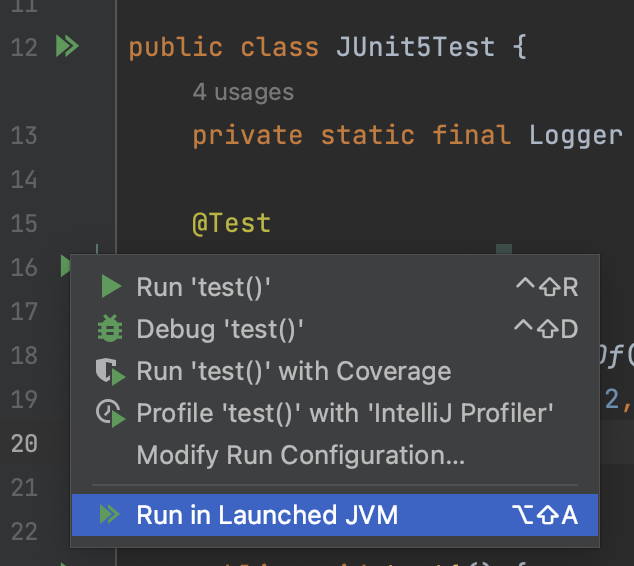
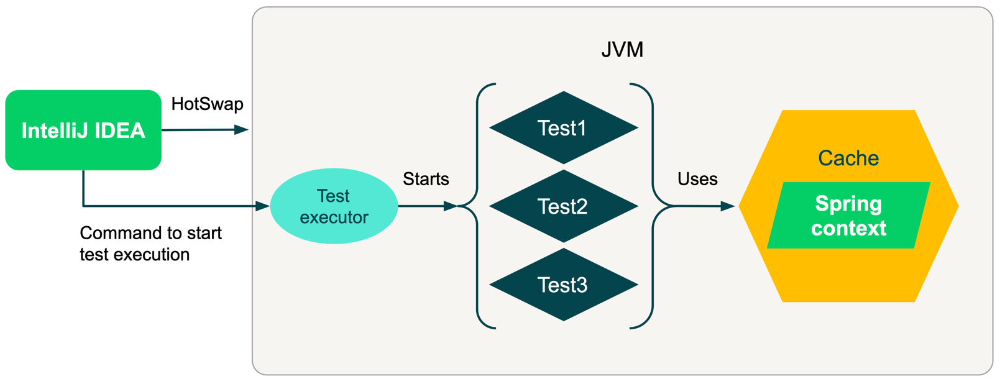

# Sprinter plugin for IntelliJ IDEA
## What problem does it try to solve?

Tests may take some to initialize itself before the actual run.
Depending on a project and tools you are using, initialization time can be significant – from a few seconds to several minutes.

During local development, you may run test a lot, and every time you run the test you have to wait for test initialization. This plugin simply allows you to run tests reusing the JVM, and it's already initialized state, thus excluding test initialization time for sequential runs.

This plugin utilizes the power of hotswap feature, so it's recommended to use DCEVM together with this plugin. You can see how to configure the plugin for working with DCEVM in a related section: [DCEVM configuration](#dcevm-configuration) 

Tested with [Spring Framework](https://spring.io), but it should work with any tool that may take some time to initialize itself and can be easily reused afterward. For example – [Testcontainers](https://testcontainers.com).

## Supported technologies

Supported test frameworks:
* TestNG
* JUnit

Supported languages:
* Java
* Kotlin

Known issues:
* The plugin will not work if you are using Gradle and IntelliJ IDEA is configured to run tests using Gradle. 
In this case IDEA will run test using this command: `gradle test`. And to my knowledge, there is no way to override test executor when using this command. 

## How does it work?

First of all, you should choose a test you want to run. You will see a new option added in a dropdown with run options (see screenshot).

Just for example’s sake, let's assume that you are using Spring Framework in your project.

When you click it, IntelliJ IDEA will build your project, startup JVM process in debug mode with a test executor in it, and send a command to the test executor to start tests you selected. This test executor is a part of the plugin, so you don't have to worry about it.

Test executor will run your tests, which will initialize Spring context before the actual run. Spring is caching its context in static variable, so you don't have to do anything additional to cache it.

When the tests are completed, JVM is still up and running with the test executor waiting for the next command to run the tests. When you try to run the tests again, the IDE will perform the hotswap to update the code, send the command to run next tests, and new tests will not waste your time by initialization because Spring context is already there.

You can also look at the work schema:

## Installation

You can find the [Sprinter](https://plugins.jetbrains.com/plugin/21623-sprinter) plugin in JetBrains Marketplace. After installing it to your IDE you are ready to go.

It's recommended to use DCEVM together with this plugin: [DCEVM configuration](#dcevm-configuration)

## DCEVM configuration

DCEVM is a Java HotSpot patch that enables many more cases for hotswap compared to the default implementation. By default, hotswap in Java works only with method bodies, which is not enough for comfort development, of course. 

It's also recommended to install HotSwap Agent together with DCEVM. It's a Java Agent that makes it possible to update application state when hotswap is performed. For example, it can update Spring context when the configuration is changed.

First of all, you need to install the DCEVM (with HotSwap Agent if you want). You can follow [official instructions](http://hotswapagent.org/mydoc_quickstart-jdk17.html).

After that, you should select installed DCEVM as project SDK in IntelliJ IDEA, then go to the plugin settings (Settings -> Tools -> Sprinter Settings) and change configured JVM from _Plain_ to _DCEVM_ and select HotSwap Agent jar location (if you also installed HotSwap Agent). 

And that's it, you are ready to go! 

You may also notice that there are more settings related to DCEVM, but they are not mandatory to fill in.

## More Information
 Article (more settings explained): TODO

 Meet up recording: https://youtu.be/BTnDNLgAbEM